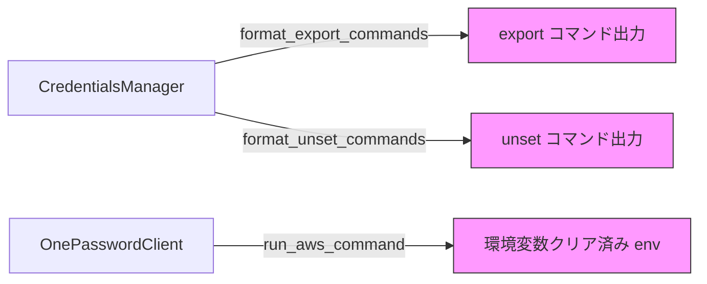

# 設計ドキュメント: AWS_PROFILE export 廃止

## 概要

awsop CLI ツールにおいて、`AWS_PROFILE` 環境変数の管理（export / unset / 環境変数クリア）を完全に廃止する。

現在、awsop は STS で取得した一時認証情報（`AWS_ACCESS_KEY_ID` 等）と同時に `AWS_PROFILE` も設定しているが、`AWS_PROFILE` は AWS CLI/SDK にプロファイルベースの認証情報を参照させる環境変数であり、一時認証情報と競合する可能性がある。awsop は独自の `AWSOP_PROFILE` でプロファイル名を管理しているため、`AWS_PROFILE` の設定は不要かつ有害である。

変更は3箇所に限定される:
1. `CredentialsManager.format_export_commands()` — `export AWS_PROFILE=...` 行の除去
2. `CredentialsManager.format_unset_commands()` — `unset AWS_PROFILE` 行の除去
3. `OnePasswordClient.run_aws_command()` — 環境変数クリアリストから `AWS_PROFILE` の除去

## アーキテクチャ

本変更はアーキテクチャの変更を伴わない。既存のモジュール構成を維持したまま、各メソッド内のリスト定義から `AWS_PROFILE` を削除するのみである。



変更対象（ピンク）は各メソッドの出力部分のみ。

## コンポーネントとインターフェース

### CredentialsManager（`src/awsop/app/credentials_manager.py`）

#### `format_export_commands(credentials: Credentials) -> str`

変更前の出力（8行）:
```
export AWS_ACCESS_KEY_ID=...
export AWS_SECRET_ACCESS_KEY=...
export AWS_SESSION_TOKEN=...
export AWS_REGION=...
export AWS_DEFAULT_REGION=...
export AWS_PROFILE=...          ← 削除
export AWSOP_PROFILE=...
export AWSOP_EXPIRATION=...
```

変更後の出力（7行）:
```
export AWS_ACCESS_KEY_ID=...
export AWS_SECRET_ACCESS_KEY=...
export AWS_SESSION_TOKEN=...
export AWS_REGION=...
export AWS_DEFAULT_REGION=...
export AWSOP_PROFILE=...
export AWSOP_EXPIRATION=...
```

#### `format_unset_commands() -> str`

変更前の出力（8行）:
```
unset AWS_ACCESS_KEY_ID
unset AWS_SECRET_ACCESS_KEY
unset AWS_SESSION_TOKEN
unset AWS_REGION
unset AWS_DEFAULT_REGION
unset AWS_PROFILE              ← 削除
unset AWSOP_PROFILE
unset AWSOP_EXPIRATION
```

変更後の出力（7行）:
```
unset AWS_ACCESS_KEY_ID
unset AWS_SECRET_ACCESS_KEY
unset AWS_SESSION_TOKEN
unset AWS_REGION
unset AWS_DEFAULT_REGION
unset AWSOP_PROFILE
unset AWSOP_EXPIRATION
```

### OnePasswordClient（`src/awsop/services/onepassword.py`）

#### `run_aws_command(command: list[str]) -> dict`

環境変数クリアリストの変更:

変更前（8項目）:
```python
aws_env_vars = [
    "AWS_ACCESS_KEY_ID",
    "AWS_SECRET_ACCESS_KEY",
    "AWS_SESSION_TOKEN",
    "AWS_PROFILE",              # ← 削除
    "AWS_DEFAULT_REGION",
    "AWS_REGION",
    "AWSOP_PROFILE",
    "AWSOP_EXPIRATION",
]
```

変更後（7項目）:
```python
aws_env_vars = [
    "AWS_ACCESS_KEY_ID",
    "AWS_SECRET_ACCESS_KEY",
    "AWS_SESSION_TOKEN",
    "AWS_DEFAULT_REGION",
    "AWS_REGION",
    "AWSOP_PROFILE",
    "AWSOP_EXPIRATION",
]
```

## データモデル

データモデルの変更はない。`Credentials` データクラスは `profile` フィールドを引き続き保持する（`AWSOP_PROFILE` の値として使用されるため）。

```python
@dataclass
class Credentials:
    access_key_id: str
    secret_access_key: str
    session_token: str
    expiration: datetime
    region: str
    profile: str  # AWSOP_PROFILE として使用（変更なし）
```

## 正当性プロパティ

*プロパティとは、システムのすべての有効な実行において成立すべき特性や振る舞いのことである。人間が読める仕様と機械的に検証可能な正当性保証の橋渡しとなる。*

prework 分析により、要件の受け入れ基準を以下の3つの独立したプロパティに集約した。各要件の正・逆の条件（「含む」と「含まない」）は、正確な変数セットの検証として1つのプロパティに統合している。

### Property 1: export コマンドの変数セットと値の正確性

*任意の*有効な認証情報（access_key_id, secret_access_key, session_token, region, profile, expiration）に対して、`format_export_commands()` の出力は以下を満たす:
- 正確に7行の export コマンドを含む
- `AWS_ACCESS_KEY_ID`、`AWS_SECRET_ACCESS_KEY`、`AWS_SESSION_TOKEN`、`AWS_REGION`、`AWS_DEFAULT_REGION`、`AWSOP_PROFILE`、`AWSOP_EXPIRATION` の各変数が正しい値で設定される
- `AWS_PROFILE` の export コマンドを含まない

**検証: 要件 1.1, 1.2, 1.3**

### Property 2: unset コマンドの変数セットの正確性

*任意の*呼び出しに対して、`format_unset_commands()` の出力は以下を満たす:
- 正確に7行の unset コマンドを含む
- `AWS_ACCESS_KEY_ID`、`AWS_SECRET_ACCESS_KEY`、`AWS_SESSION_TOKEN`、`AWS_REGION`、`AWS_DEFAULT_REGION`、`AWSOP_PROFILE`、`AWSOP_EXPIRATION` の各変数が unset される
- `AWS_PROFILE` の unset コマンドを含まない

**検証: 要件 2.1, 2.2**

### Property 3: 環境変数クリアの変数セットの正確性

*任意の*環境変数セット（対象の7変数と `AWS_PROFILE` を含む）に対して、`run_aws_command()` が準備する環境は以下を満たす:
- `AWS_ACCESS_KEY_ID`、`AWS_SECRET_ACCESS_KEY`、`AWS_SESSION_TOKEN`、`AWS_DEFAULT_REGION`、`AWS_REGION`、`AWSOP_PROFILE`、`AWSOP_EXPIRATION` が除去されている
- `AWS_PROFILE` が保持されている（クリア対象に含まれない）

**検証: 要件 3.1, 3.2**

## エラーハンドリング

本変更はリスト定義からの項目削除のみであり、新たなエラーパスは発生しない。既存のエラーハンドリング（`subprocess.CalledProcessError`、`json.JSONDecodeError` 等）はそのまま維持される。

## テスト戦略

### プロパティベーステスト

ライブラリ: **Hypothesis**（既にプロジェクトで使用中、`hypothesis>=6.82.0`）

既存のプロパティテストファイルを更新する:

1. **`tests/property/test_export_commands.py`** — Property 1 の検証
   - 既存テスト `test_property_3_export_command_completeness` を更新
   - `required_vars` リストから `AWS_PROFILE` を削除
   - `export AWS_PROFILE=` のアサーションを削除
   - `AWS_PROFILE` が出力に含まれないことのアサーションを追加
   - 行数の期待値を8から7に変更
   - 最低100回のイテレーション
   - タグ: `Feature: remove-aws-profile-export, Property 1: export コマンドの変数セットと値の正確性`

2. **`tests/property/test_unset_commands.py`** — Property 2 の検証
   - 既存テスト `test_property_5_unset_command_completeness` を更新
   - `required_vars` リストから `AWS_PROFILE` を削除
   - `AWS_PROFILE` が出力に含まれないことのアサーションを追加
   - 行数の期待値を8から7に変更
   - 最低100回のイテレーション
   - タグ: `Feature: remove-aws-profile-export, Property 2: unset コマンドの変数セットの正確性`

3. **新規テスト `tests/property/test_env_cleanup.py`** — Property 3 の検証
   - ランダムな環境変数辞書を生成し、対象7変数と `AWS_PROFILE` を含める
   - `run_aws_command()` 実行後の環境を検証
   - 対象7変数が除去され、`AWS_PROFILE` が保持されることを確認
   - 最低100回のイテレーション
   - タグ: `Feature: remove-aws-profile-export, Property 3: 環境変数クリアの変数セットの正確性`

### ユニットテスト

1. **`tests/unit/test_onepassword.py`** — 既存テストの更新
   - `test_run_aws_command_success` のアサーションを更新: `AWS_PROFILE` が環境に保持されることを確認

### テスト実行

```bash
uv run pytest tests/property/test_export_commands.py tests/property/test_unset_commands.py tests/property/test_env_cleanup.py tests/unit/test_onepassword.py -v
```

### 各プロパティテストの要件

- 各プロパティテストは設計ドキュメントのプロパティを参照するコメントを含む
- 各テストは最低100回のイテレーションで実行する（`@settings(max_examples=100)`）
- 1つの正当性プロパティにつき1つのプロパティベーステストを実装する
